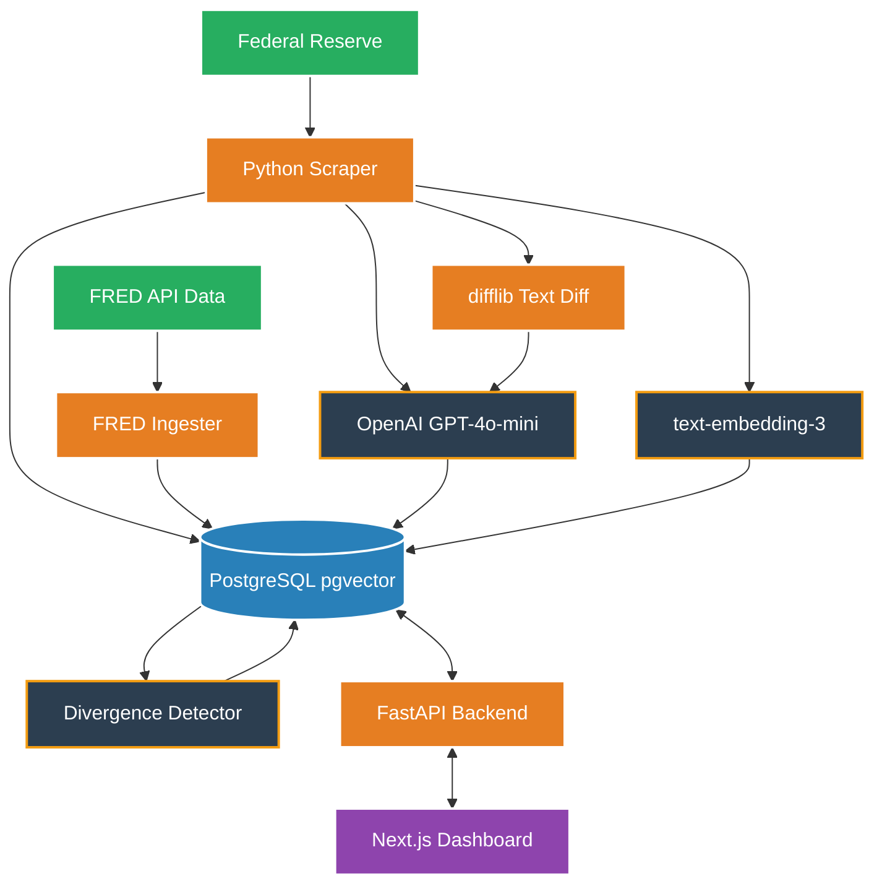

# 🏦 FedLens: Monetary Policy Intelligence System

<div align="center">
  
  
  
  
  
</div>

<br>

**FedLens** is an evidence-grounded monetary-policy intelligence system. It combines Federal Open Market Committee (FOMC) communications with real-time economic data to detect changes in policy stance, grade the economy, and identify contradictions between Fed rhetoric and actual economic indicators. 
The system provides a Next.js web interface, interactive time-series visualizations for economic data, semantic text diffing for FOMC statements, and a Retrieval-Augmented Generation (RAG) Q&A engine.

---

## 🏗 System Architecture & Data Flow



---

## ✨ Key Features

- **6-Dimension AI Grading**: Uses strict Structured Outputs to grade the Fed's statement across 6 dimensions: *Overall Stance, Inflation, Labor Market, Economic Growth, Financial Conditions, and Forward Guidance*.
- **Semantic Text Diffing**: Computes exact word-by-word changes between consecutive meetings and visualizes them using GitHub-style `[ADDED]` and `[DELETED]` redline highlighting in the UI.
- **Narrative Divergence Detection**: Compares the Fed's claims against raw FRED data (adjusted for release dates to prevent look-ahead bias). If the Fed says "job gains are robust" but the actual `UNRATE` worsened, the AI flags a Divergence.
- **Interactive Time-Series Charts**: Dynamically pulls the previous 24 months of raw macroeconomic data (Core PCE, CPI, Treasury Yields) and graphs it with a vertical marker indicating the exact date of the FOMC meeting.
- **RAG Q&A Engine**: Features a hybrid search (BM25 + Semantic Cosine Similarity) querying the `pgvector` database to accurately answer questions strictly based on historical FOMC statements.

---

## 🚀 Quick Start

### 1. Prerequisites
- **Docker Desktop** (must be running for PostgreSQL)
- **Python 3.10+** and the `uv` package manager
- **Node.js** and `pnpm`

### 2. Configuration
Create a `.env` file in the root directory:
```text
FRED_API_KEY="your_key_here"
OPENAI_API_KEY="your_key_here"
LLM_MODEL="gpt-4o-mini"
```

### 3. Backend Setup & Ingestion
Install Python dependencies, start the database, and run the pipeline to populate the past 2 years of data (16 meetings):
```bash
# Install Python dependencies
uv sync

# Start PostgreSQL database with pgvector
docker compose up -d

# Run database migrations
uv run alembic upgrade head

# Run the Ingestion & Analysis Pipeline (This will hit OpenAI APIs)
uv run python -m app.analysis.pipeline
```

### 4. Run the Servers
You need to run both the FastAPI backend and the Next.js frontend simultaneously in separate terminal windows.

**Terminal 1: Start the FastAPI Backend**
```bash
uv run uvicorn app.api.main:app --reload
```

**Terminal 2: Start the Next.js Frontend**
```bash
cd frontend
pnpm install
pnpm run dev
```

### 5. View Dashboard
Navigate to [http://localhost:3000](http://localhost:3000) in your browser to view the FedLens Intelligence System.

---
*Disclaimer: This is a portfolio project and should not be used for actual financial trading or investment advice.*

<br>

<div align="center">
  <p><b>Built by Atharv</b></p>
</div>
